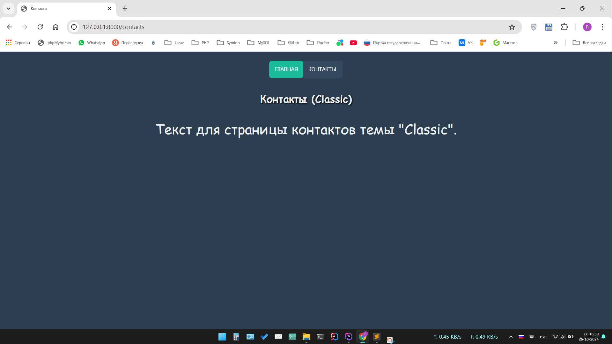
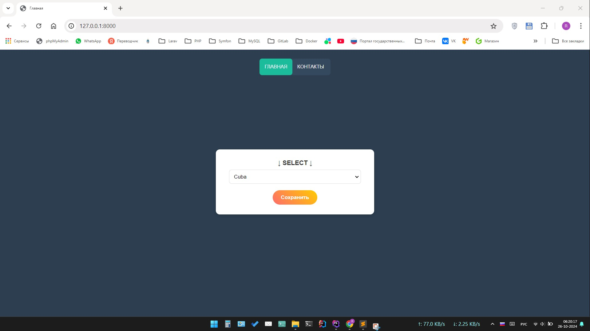
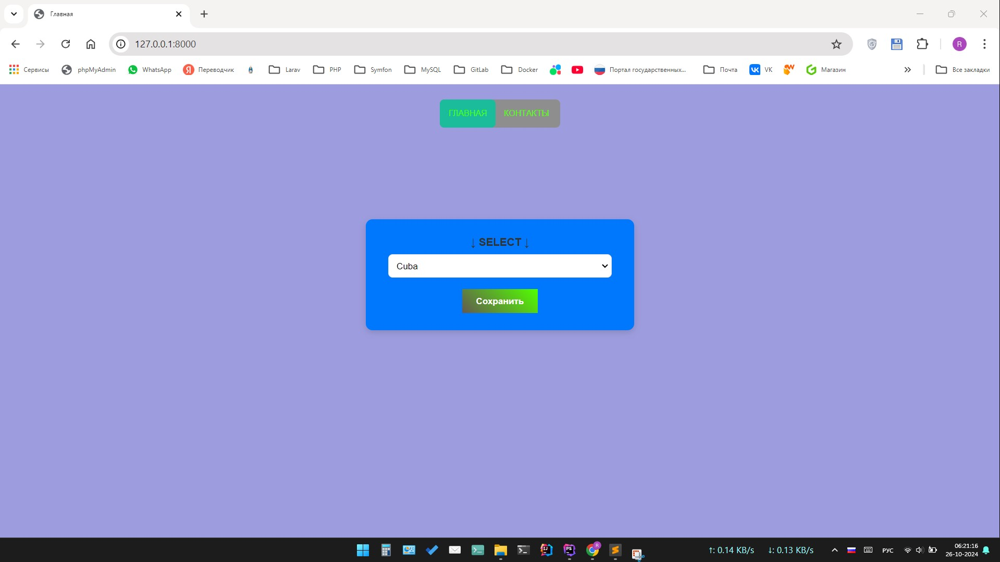
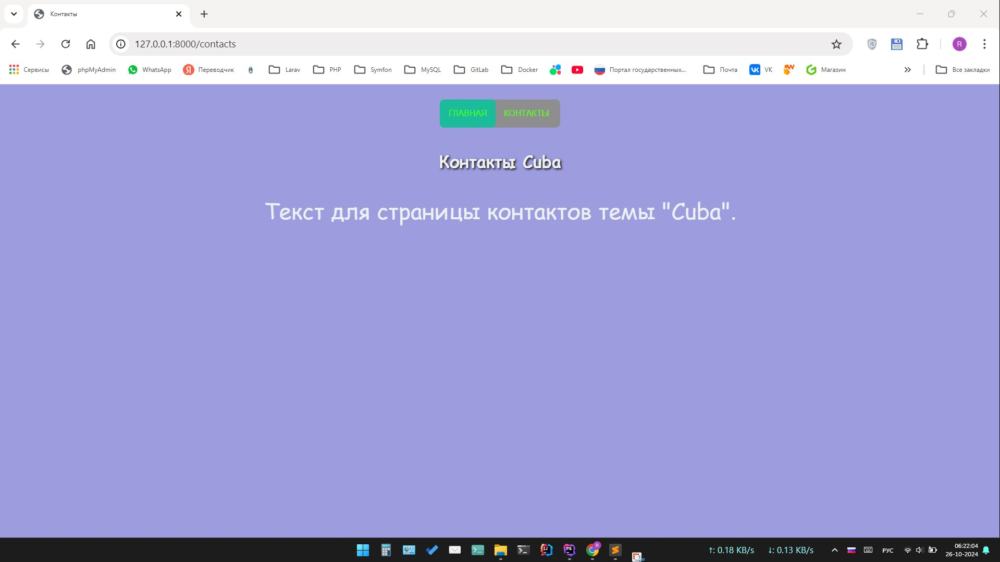
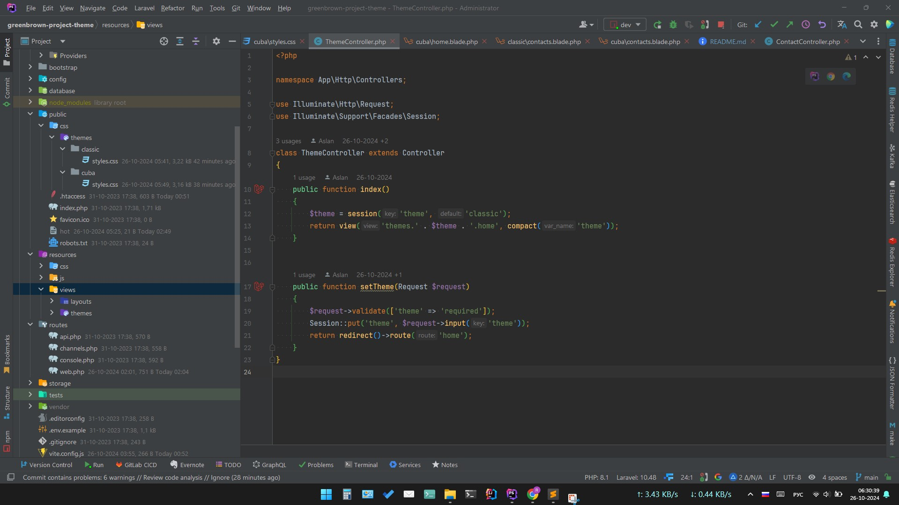
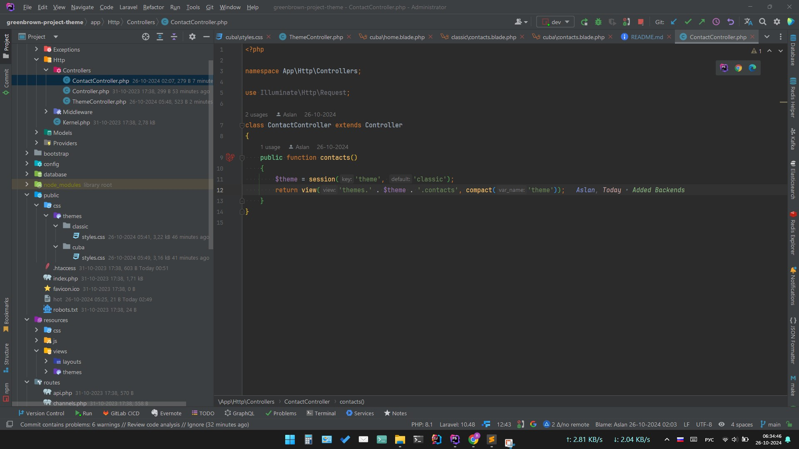
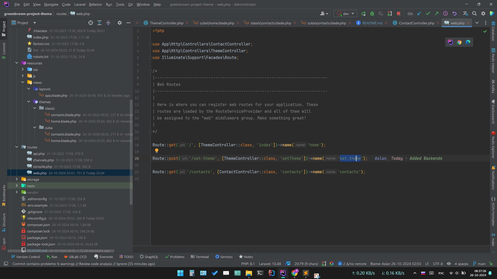

## About Laravel

Создать чистый ларавел Создать две темы с названиями (classic, cuba). Они должны лежать в views/themes/{name}/… Сделать две страницы (главная и контакты). На главной странице будет форма с select и кнопкой сохранить. (Выбор темы) На станице контакты любой текст, который должен находится в компоненте (у каждой темы текст должен отличаться). На каждой странице навигация по разделам. У каждой темы дизайн кнопки уникальный (главное должно отличаться). Достаточно только стили кнопки (плюсом будет и другие элементы стилизировать). Стили кладём в public в соответствующую названию темы.

The Laravel framework is open-sourced software licensed under the [MIT license](https://opensource.org/licenses/MIT).
